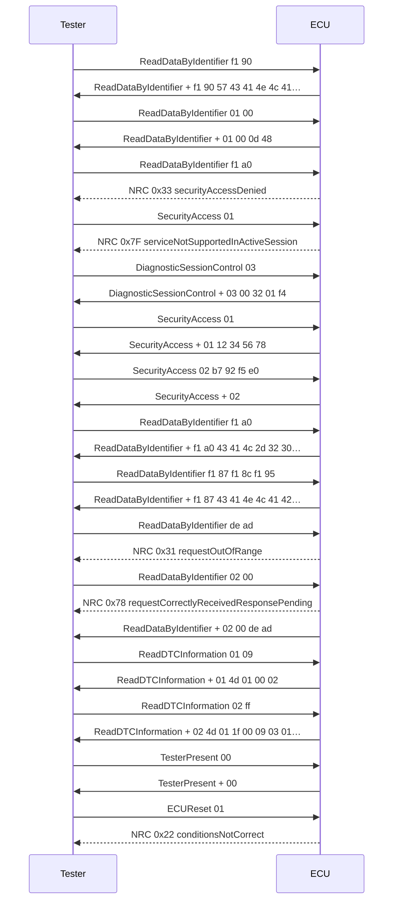

# CAN log report

46 frames, 2 IDs, 0.31 s, 15 UDS transactions.

## Findings

| Sev | Rule | t (s) | Subject | Message |
|---|---|---|---|---|
| WARNING | R008 | 0.002 | UDS | ReadDataByIdentifier -> NRC 0x33 securityAccessDenied |
| WARNING | R008 | 0.003 | UDS | SecurityAccess -> NRC 0x7F serviceNotSupportedInActiveSession |
| WARNING | R008 | 0.006 | UDS | ReadDataByIdentifier -> NRC 0x31 requestOutOfRange |
| WARNING | R008 | 0.310 | UDS | … 1 more like this, last at t+0.307s (frame 45) |
| INFO | R008 | 0.007 | UDS | ReadDataByIdentifier -> NRC 0x78 requestCorrectlyReceivedResponsePending |

## Messages

| ID | Name | Count | Period (ms) | Expected | DLC | Last decoded |
|---|---|---|---|---|---|---|
| 0x7E0 |  | 19 | 0.5 | -  | 8 |  |
| 0x7E8 |  | 27 | 0.4 | -  | 8 |  |

## UDS

