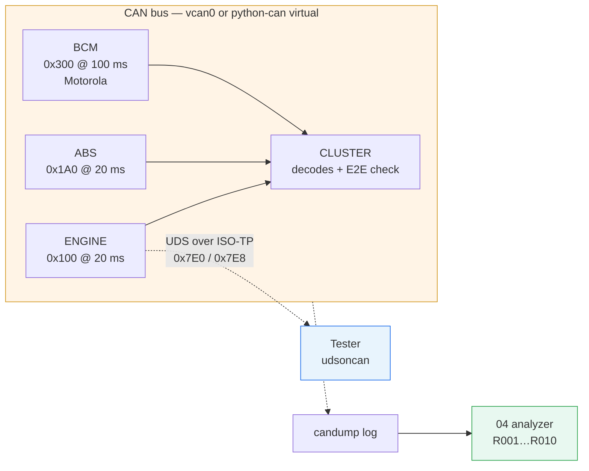

# CAN Bus Lab

*[中文](README.zh-CN.md)*

Learning the in-vehicle network stack from zero in two weeks — CAN, DBC, E2E,
ISO-TP, UDS and SocketCAN — by building four small things that work.

> **Started from zero.** In two weeks: from a hand-written DBC and three ECUs
> on a virtual bus, through a UDS server with sessions and security access, to
> reverse-engineering a bus you did not build, to a log analyzer that catches
> the failures none of the standard tools look for.

Sibling of [ev-charging-lab](https://github.com/Yihao23/ev-charging-lab), same
shape: every project proves one claim, every README ends with what was
actually run, and the gaps marked `TODO(you)` are where the learning is.

---

## The system in one picture



**The one thing to understand first:** CAN has no addresses. A frame carries
an identifier that says *what* it is, every node hears every frame, and the
lowest identifier wins the bus. Everything else — the DBC, cycle times, E2E,
diagnostics on `0x7E0`/`0x7E8` — is convention layered on top of that fact.

**The question every interview asks:**
*"A node keeps dropping off the bus. Walk me through it."*

```
error active ──(TEC or REC ≥ 128)──► error passive ──(TEC > 255)──► bus-off
   dominant error flags               recessive flags,                silent.
   can abort anyone's frame           +8 bit suspend                  no error frames,
                                                                      just absence.
```

Project **01** injects the absence. Project **04** finds it (rule R002). The
glossary and Q&A explain why nothing in this lab can *show* the counters —
and what hardware you would need to.

---

## The four projects

| # | Project | What it proves | Status |
|---|---|---|---|
| **01** | [Virtual vehicle: three ECUs on a bus](01-virtual-vehicle/) | You can write a DBC, encode Motorola by hand, compute bus load, protect a frame with E2E | ✅ 29 tests, six injectable faults, live dashboard |
| **02** | [UDS diagnostics: sessions, security, DIDs, DTCs](02-uds-diagnostics/) | You can implement a protocol from the side that enforces the rules | ✅ 49 tests, real ISO-TP end to end |
| **03** | [Bus analysis: ICSim and uds-server, blind](03-bus-analysis/) | You can read a bus you had never seen | ⬜ template + tools; the report is yours to write |
| **04** | [CAN log analyzer](04-can-log-analyzer/) | You can diagnose, which is the actual daily job | ✅ 40 tests, 10 rules, HTML reports |

Each project's README has its own quick start, the design decisions to defend,
the `TODO(you)` list, and a "Verified" table that says what was run and what
was not.

---

## What the four projects found

Building them was the point; what they turned up is the part worth reading.

**A tester cannot decode a multi-DID reply without the ECU's DID table.**
There is no delimiter on the wire: `62 F187 …F18C …F195 …` is one byte
stream, and only the tester's own configuration says where one value ends.
udsoncan refuses a variable-length codec anywhere but last. That is the
practical reason ODX files exist, and why a generic workshop tool cannot
read a new ECU. [Project 02](02-uds-diagnostics/).

**Learning a cycle time from the log needs a robust statistic.** The first
version of rule R001 used the standard deviation of the gaps to decide
whether a message was cyclic; a single 800 ms hole in a 100 ms message made
it refuse to learn the cycle — and the hole was the thing it should have
reported. Requiring 70 % of the gaps to sit within 20 % of the median fixed it; the median absolute deviation was tried in between and fooled by event messages that come in bursts of two. [Project 04](04-can-log-analyzer/).

**A stuck alive counter produces one finding per frame.** 124 identical
lines for a 2.5 s log. The fix — fold repeats per rule and subject, but only
in the human-readable formats — is a small design decision that changes
whether anyone reads the output. [Project 04](04-can-log-analyzer/).

**Python thread scheduling shows up as R001 gaps.** Even the healthy sample
occasionally shows a 30 ms gap in a 20 ms message on the in-process virtual
bus. That is real jitter from the host, not from the protocol; it is why
`samples/jitter.log` exists and why R011 is left for you.

---

## 60-second demo

```bash
setup/bootstrap.sh && source .venv/bin/activate

# 1. three ECUs, one cluster, no kernel module needed
cd 01-virtual-vehicle
python -m vehicle --channel virtual --duration 5 --fault stuck-counter --fault bad-crc=10
#   cluster  t=  0.50s  rpm=  1318  speed=  3.6 km/h  turn=Off  frames=56  e2e_faults=3

# 2. a UDS session against the engine ECU, in one process
cd ../02-uds-diagnostics
python -m tester --channel virtual --log ../04-can-log-analyzer/samples/mine.log
#   tester  security access (seed/key)         OK   True
#   tester  ECU reset while engine runs        NRC  0x22 ConditionsNotCorrect

# 3. analyse what just went over the wire
cd ../04-can-log-analyzer
python3 -m cananalyzer samples/mine.log
python3 -m cananalyzer samples/faulty.log --dbc samples/lab_vehicle.dbc --format html -o report.html
```

Everything above runs on a laptop with no root. For `candump`, Wireshark and
the project 03 targets you need `sudo apt install can-utils` and
`sudo setup/vcan-up.sh` — see [TROUBLESHOOTING.md](TROUBLESHOOTING.md). Then
drop `--channel virtual` and every process on the machine shares one bus:

```bash
python -m vehicle --duration 30 &            # project 01 on vcan0
candump -td -c vcan0                         # watch it
cansend vcan0 100#0000000000000000           # forge an ENGINE_DATA frame — the cluster rejects it (CRC)
echo "22 F1 90" | isotpsend -s 7E0 -d 7E8 vcan0   # read the VIN from project 02's ECU with no Python at all
```

---

## Documentation

| Doc | What |
|---|---|
| [`docs/GLOSSARY.md`](docs/GLOSSARY.md) | Every term, from CAN_H to Dcm, with the numbers (128, 255, 120 Ω, 135 bits) |
| [`docs/14-DAY-PLAN.md`](docs/14-DAY-PLAN.md) | The plan, one commit per day |
| [`03-bus-analysis/report/REPORT-TEMPLATE.md`](03-bus-analysis/report/REPORT-TEMPLATE.md) | The report you write about a bus you did not build |
| [`04-can-log-analyzer/samples/`](04-can-log-analyzer/samples/) | Generated reports, Markdown and HTML, one with an SVG bus-load plot |
| [`TROUBLESHOOTING.md`](TROUBLESHOOTING.md) | vcan, can-utils, udsoncan, Wireshark gotchas |

---

## Optional project 05 — real hardware

The only way to *see* arbitration, error frames and bus-off. Two boards with
CAN peripherals (a Nucleo-H723ZG has FDCAN), two transceivers (TJA1050 /
SN65HVD230 breakouts), a metre of twisted pair, two 120 Ω resistors, and a
USB-CAN adapter (candleLight firmware gives you SocketCAN on `can0`). Then:

- remove one terminator and watch the error counters in the debugger;
- send two frames at once from two boards and read back who won;
- short CAN_L to ground and watch a node go bus-off, then recover.

Not started. Listed because an interviewer will ask what you could not do
without hardware, and this is the honest answer.

---

## Screenshots


Project 01's instrument cluster in the browser, standard library only. Left,
what the cluster decoded; right, what is on the wire. `ENGINE_DATA` is
rejecting a bad CRC every 40th frame and the needle does not flinch; `ABS_DATA`
is losing 3 % of its frames and the `lost` column reads 0 — because the
counter check is a `TODO(you)`, and this column is how you will know it works.

## Open source used

| Project | Role here |
|---|---|
| [hardbyte/python-can](https://github.com/hardbyte/python-can) | Bus abstraction, `virtual` + `socketcan`, candump-format `Logger` — projects 01, 02 |
| [cantools/cantools](https://github.com/cantools/cantools) | DBC parsing, encode/decode — project 01 |
| [pylessard/python-can-isotp](https://github.com/pylessard/python-can-isotp) | ISO 15765-2 in Python — project 02 |
| [pylessard/python-udsoncan](https://github.com/pylessard/python-udsoncan) | ISO 14229 client — project 02 |
| [linux-can/can-utils](https://github.com/linux-can/can-utils) | `candump`, `cansend`, `cangen`, `canplayer`, `isotpsend` — everywhere |
| [zombieCraig/ICSim](https://github.com/zombieCraig/ICSim) | A bus to reverse-engineer — project 03 |
| [zombieCraig/uds-server](https://github.com/zombieCraig/uds-server) | An ECU to probe — project 03 |
| [CaringCaribou/caringcaribou](https://github.com/CaringCaribou/caringcaribou) | UDS discovery and DID dumping — project 03 |
| [commaai/opendbc](https://github.com/commaai/opendbc) | Real-car DBCs to read for style |
| [collin80/SavvyCAN](https://github.com/collin80/SavvyCAN) | GUI analysis with DBC support |
| [iDoka/awesome-canbus](https://github.com/iDoka/awesome-canbus) | Index of everything else |

---

## Tests

```bash
source .venv/bin/activate
(cd 01-virtual-vehicle  && python  -m unittest discover -s tests)   # 29 passed
(cd 02-uds-diagnostics  && python  -m unittest discover -s tests)   # 49 passed
(cd 04-can-log-analyzer && python3 -m unittest discover -s tests)   # 40 passed, no venv needed
```

None of them need `vcan0`, `can-utils` or root: they run on python-can's
in-process virtual bus. Project 04 is standard-library only, on purpose: a
diagnostic tool is worth more if it runs on a test rig's embedded Linux
without a package manager.

`03` has no tests — it is a reading and writing project, and its output is
the report.
