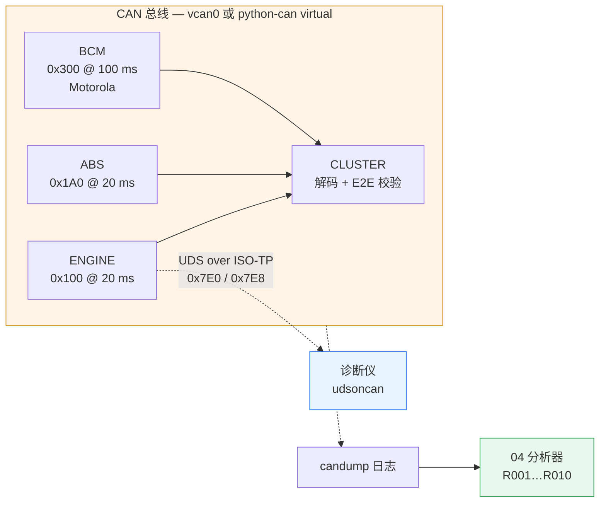
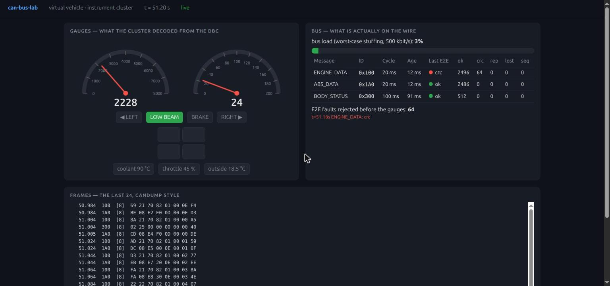

# CAN 总线实验室

*[English](README.md)*

两周从零学会车载网络协议栈 —— CAN、DBC、E2E、ISO-TP、UDS 和 SocketCAN ——
方法是造四个能跑的小东西。

> **从零开始。** 两周内: 从一份手写的 DBC 和虚拟总线上的三个 ECU，到带会话和安全访问的
> UDS 服务端，到逆向一条不是你搭的总线，到一个能抓出标准工具都不看的故障的日志分析器。

[ev-charging-lab](https://github.com/Yihao23/ev-charging-lab) 的姊妹项目，形态相同:
每个项目证明一个主张，每份 README 以"实际跑过什么"收尾，标着 `TODO(you)` 的缺口就是学习本身。

---

## 一张图看系统



**第一件要理解的事:** CAN 没有地址。一帧带一个说明"它是什么"的标识符，每个节点听见每一帧，
标识符最小的赢得总线。其它一切 —— DBC、周期、E2E、`0x7E0`/`0x7E8` 上的诊断 ——
都是叠在这个事实之上的约定。

**每场面试都会问的题:**
*"一个节点老是掉线，讲一遍发生了什么。"*

```
主动错误 ──(TEC 或 REC ≥ 128)──► 被动错误 ──(TEC > 255)──► bus-off
  显性错误标志                    隐性错误标志，              沉默。
  能打断任何人的帧                发送前多等 8 位              没有错误帧，
                                                             只有缺席。
```

项目 **01** 注入这种缺席。项目 **04** 找到它(规则 R002)。术语表和问答解释了为什么
这个实验室里没有任何东西能*显示*错误计数器 —— 以及要看它们需要什么硬件。

---

## 四个项目

| # | 项目 | 证明什么 | 状态 |
|---|---|---|---|
| **01** | [虚拟整车: 总线上的三个 ECU](01-virtual-vehicle/) | 会写 DBC、会手算 Motorola 字节序、会算总线负载、会用 E2E 保护帧 | ✅ 24 个测试，六种可注入故障，实时仪表页 |
| **02** | [UDS 诊断: 会话、安全、DID、DTC](02-uds-diagnostics/) | 能从"执行规则"的一侧实现协议 | ✅ 49 个测试，真实 ISO-TP 端到端 |
| **03** | [总线分析: 盲做 ICSim 和 uds-server](03-bus-analysis/) | 能读一条从没见过的总线 | ⬜ 模板 + 工具；报告要你自己写 |
| **04** | [CAN 日志分析器](04-can-log-analyzer/) | 会诊断 —— 这才是每天真正的工作 | ✅ 40 个测试，10 条规则，HTML 报告 |

每个项目的 README 都有自己的快速开始、要辩护的设计决策、`TODO(you)` 清单，
以及一张"已验证"表，写明跑过什么、没跑过什么。

---

## 四个项目发现了什么

造它们是目的；它们翻出来的东西才是值得读的部分。

**没有 ECU 的 DID 表，诊断仪拆不开多 DID 响应。** 线上没有分隔符: `62 F187 …F18C …F195 …`
是一条字节流，只有诊断仪自己的配置知道一个值在哪结束。udsoncan 拒绝把变长编解码器放在
最后一个以外的位置。这就是 ODX 文件存在的实际原因，也是通用诊断仪读不了新 ECU 的原因。
[项目 02](02-uds-diagnostics/)。

**从日志里学周期需要鲁棒统计量。** R001 第一版用间隔的标准差判断报文是否周期；
100 ms 报文里一个 800 ms 的洞就让它拒绝学习周期 —— 而这个洞恰恰是它该报告的东西。
改成"七成的间隔落在中位数 ±20% 内"就好了；中间试过中位绝对偏差，被成对突发的事件报文骗过。[项目 04](04-can-log-analyzer/)。

**卡死的计数器每帧产生一条发现。** 2.5 秒日志 124 行一模一样。修法 —— 按规则和对象折叠重复，
但只在给人看的格式里 —— 是个小决定，却决定了有没有人看输出。[项目 04](04-can-log-analyzer/)。

**Python 线程调度会表现为 R001 的间隔告警。** 即使健康样本，进程内虚拟总线上的 20 ms 报文
也偶尔出现 30 ms 间隔。这是宿主机的真实抖动，不是协议的；`samples/jitter.log` 因此存在，
R011 因此留给你。

---

## 60 秒演示

```bash
setup/bootstrap.sh && source .venv/bin/activate

# 1. 三个 ECU、一块仪表，不需要内核模块
cd 01-virtual-vehicle
python -m vehicle --channel virtual --duration 5 --fault stuck-counter --fault bad-crc=10
#   cluster  t=  0.50s  rpm=  1318  speed=  3.6 km/h  turn=Off  frames=56  e2e_faults=3

# 2. 对发动机 ECU 做一次 UDS 会话，同一进程内
cd ../02-uds-diagnostics
python -m tester --channel virtual --log ../04-can-log-analyzer/samples/mine.log
#   tester  security access (seed/key)         OK   True
#   tester  ECU reset while engine runs        NRC  0x22 ConditionsNotCorrect

# 3. 分析刚才线上发生的事
cd ../04-can-log-analyzer
python3 -m cananalyzer samples/mine.log
python3 -m cananalyzer samples/faulty.log --dbc samples/lab_vehicle.dbc --format html -o report.html
```

以上全部在笔记本上跑，不需要 root。要用 `candump`、Wireshark 和项目 03 的靶子，
需要 `sudo apt install can-utils` 和 `sudo setup/vcan-up.sh` ——
见 [TROUBLESHOOTING.md](TROUBLESHOOTING.md)。之后去掉 `--channel virtual`，
这台机器上的所有进程就共享同一条总线:

```bash
python -m vehicle --duration 30 &            # 项目 01 跑在 vcan0 上
candump -td -c vcan0                         # 旁听
cansend vcan0 100#0000000000000000           # 伪造一帧 ENGINE_DATA —— 仪表会因 CRC 拒掉它
echo "22 F1 90" | isotpsend -s 7E0 -d 7E8 vcan0   # 一行 Python 都不用，读项目 02 ECU 的 VIN
```

---

## 文档

| 文档 | 内容 |
|---|---|
| [`docs/GLOSSARY.md`](docs/GLOSSARY.md) | 从 CAN_H 到 Dcm 的每个术语，带数字(128、255、120 Ω、135 位) |
| [`docs/14-DAY-PLAN.md`](docs/14-DAY-PLAN.md) | 计划，每天一次提交 |
| [`03-bus-analysis/report/REPORT-TEMPLATE.md`](03-bus-analysis/report/REPORT-TEMPLATE.md) | 关于一条不是你搭的总线的报告 |
| [`04-can-log-analyzer/samples/`](04-can-log-analyzer/samples/) | 生成的报告，Markdown 和 HTML，其中一份带 SVG 总线负载图 |
| [`TROUBLESHOOTING.md`](TROUBLESHOOTING.md) | vcan、can-utils、udsoncan、Wireshark 的坑 |

---

## 可选项目 05 —— 真硬件

唯一能*看见*仲裁、错误帧和 bus-off 的办法。两块带 CAN 外设的板子(Nucleo-H723ZG 有 FDCAN)、
两个收发器(TJA1050 / SN65HVD230 模块)、一米双绞线、两个 120 Ω 电阻、一个 USB-CAN 适配器
(candleLight 固件直接给你 SocketCAN 的 `can0`)。然后:

- 拔掉一个终端电阻，在调试器里看错误计数器；
- 两块板同时发两帧，回读谁赢了；
- 把 CAN_L 短到地，看一个节点 bus-off 再恢复。

没开始。列在这里是因为面试官会问"没有硬件你做不了什么"，这就是诚实的答案。

---

## 截图



项目 01 在浏览器里的仪表，只用标准库。左边是仪表解码出来的，右边是线上实际有的。
`ENGINE_DATA` 每 40 帧拒一次坏 CRC，指针纹丝不动；`ABS_DATA` 丢了 3% 的帧而 `lost` 列是 0 ——
因为计数器检查是 `TODO(you)`，这一列就是你判断自己实现是否生效的地方。

## 用到的开源项目

| 项目 | 在这里的角色 |
|---|---|
| [hardbyte/python-can](https://github.com/hardbyte/python-can) | 总线抽象，`virtual` + `socketcan`，candump 格式的 `Logger` —— 项目 01、02 |
| [cantools/cantools](https://github.com/cantools/cantools) | DBC 解析与编解码 —— 项目 01 |
| [pylessard/python-can-isotp](https://github.com/pylessard/python-can-isotp) | Python 实现的 ISO 15765-2 —— 项目 02 |
| [pylessard/python-udsoncan](https://github.com/pylessard/python-udsoncan) | ISO 14229 客户端 —— 项目 02 |
| [linux-can/can-utils](https://github.com/linux-can/can-utils) | `candump`、`cansend`、`cangen`、`canplayer`、`isotpsend` —— 到处都用 |
| [zombieCraig/ICSim](https://github.com/zombieCraig/ICSim) | 一条用来逆向的总线 —— 项目 03 |
| [zombieCraig/uds-server](https://github.com/zombieCraig/uds-server) | 一台用来探测的 ECU —— 项目 03 |
| [CaringCaribou/caringcaribou](https://github.com/CaringCaribou/caringcaribou) | UDS 发现与 DID 导出 —— 项目 03 |
| [commaai/opendbc](https://github.com/commaai/opendbc) | 真车 DBC，看写法 |
| [collin80/SavvyCAN](https://github.com/collin80/SavvyCAN) | 带 DBC 支持的图形分析工具 |
| [iDoka/awesome-canbus](https://github.com/iDoka/awesome-canbus) | 其它一切的索引 |

---

## 测试

```bash
source .venv/bin/activate
(cd 01-virtual-vehicle  && python  -m unittest discover -s tests)   # 24 passed
(cd 02-uds-diagnostics  && python  -m unittest discover -s tests)   # 49 passed
(cd 04-can-log-analyzer && python3 -m unittest discover -s tests)   # 40 passed，不需要 venv
```

它们都不需要 `vcan0`、`can-utils` 或 root: 全部跑在 python-can 的进程内虚拟总线上。
项目 04 刻意只用标准库: 诊断工具能在没有包管理器的试验台嵌入式 Linux 上跑，才更值钱。

`03` 没有测试 —— 它是一个读和写的项目，产出就是报告。
